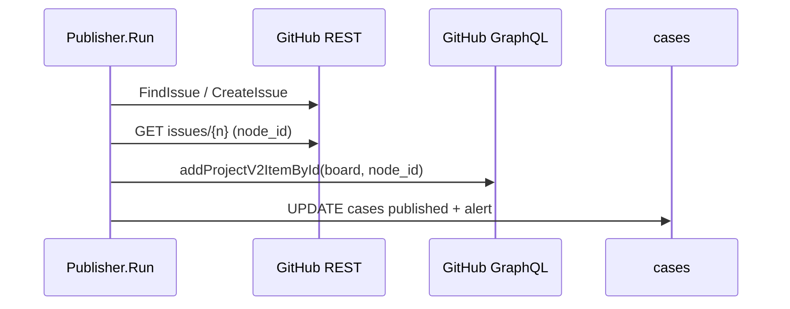

# Спека среза: адреса galera-club и тикет на доске Galera

Статус: agreed
Issue: galera-tasks#102
Architecture review: pass (проход 2, 07.10)
Каноны: `AGENTS.md`, `docs/contracts.md` (GitHub), GraphQL `addProjectV2ItemById`.

## 1. Цель и границы

- Цель: бот ходит по адресам `galera-club`, а не через редирект со старых `daniil4545`;
  новый тикет остаётся в репозитории проекта и сразу виден на доске Galera
  (`orgs/galera-club/projects/2`, решение владельца 07.10).
- Делаем: путь Go-модуля, образ `ghcr.io/galera-club/tg-intake` в `deploy.yml` и
  `safe-ssh.sh`, владелец проектов в базе миграцией, тикет на доску, документы.
- Не делаем: перенос тикетов в `galera-tasks`; поля карточки; старые тикеты на доску
  (их добавляет разбор); релиз 0.2.4 и env прода - отдельный тикет релиза.

## 2. Архитектура



| Блок | Ответственность | Взаимодействует с |
|---|---|---|
| `GitHub.AddToBoard` | issue на доску по номеру | REST, GraphQL |
| `Publisher.Run` | шаг доски после Find/Create | `GitHub`, `cases` |
| `Config.BoardID` | node id доски, пустое - шаг выключен | `GITHUB_BOARD_ID` |
| миграция 0013 | владелец четырёх проектов в `galera-club` | `projects` |

Решения:

- Доску ставит бот, а не правило доски - на тарифе Free одно правило автодобавления, его
  занимает `galera-tasks` (docs.github.com, 07.10); отброшено: `add-to-project` в каждом
  репозитории - четыре workflow и секрета; разбор агентом - карточка с опозданием;
  заденет: токену нужно `Projects: read and write` (выдано и проверено 07.10); модель: да.
- Сбой доски не роняет публикацию: лог `board_add_failed` и строка в уведомлении
  владельцу; отброшено: ошибка работы - автор увидел бы отказ на созданный тикет; модель: нет.
- simplified: сбой доски не повторяется (работа выходит на `issue_number`, `RATE_LIMITED`
  приходит с HTTP 200), карточку ставит разбор по уведомлению; пересмотреть, если сбоев
  больше одного в неделю. Старые `cases.issue_url` ведёт редирект GitHub; модель: нет.
- Шаг доски до транзакции: уведомление несёт его итог. Мутация идемпотентна (07.10:
  тикет на доске вернул свою карточку); модель: нет.
- `node_id` - через готовый `GetIssue` (поле `Issue.NodeID`): сигнатуры `CreateIssue` и
  `FindIssue` не меняются, цена - запрос на тикет. Шаг доски ограничен `githubTimeout`
  на весь шаг, чтобы повторы не съели `jobTimeout` транзакции; модель: нет.
- Владелец - миграцией: `SyncProjects` существующие строки не трогает. Down возвращает
  `daniil4545` только четырём slug; модель: нет.

## 3. Сценарии

| Сценарий | Начальное состояние и шаги | Результат |
|---|---|---|
| Happy path | доска задана, «Публикую» | issue и карточка, уведомление без строки о доске |
| Доска выключена | `GITHUB_BOARD_ID` пуст | ни одного запроса к GraphQL |
| Повтор | ответ на POST потерян | `FindIssue` находит маркер, мутация вернёт ту же карточку |
| Временная ошибка | 5xx, 429 | повторы `call` в пределах таймаута шага, затем как постоянная |
| Постоянная ошибка | GraphQL 200 с `errors` (право, id доски) | тикет опубликован, `board_add_failed`, строка «На доску Galera не добавлен» в уведомлении |
| Непредусмотренное | нет `node_id` или `item.id` | ошибка с контекстом, как постоянная |

## 3a. Рубежи молчания

Не применимо: новый шаг пишет только во внутреннюю доску команды. Сообщений автору,
лидам и клиентам срез не добавляет, тексты автору не меняются.

## 3b. Сценарии проверки

| # | Дано / когда / тогда | Риск | Факт проверки | Ярус | Тест |
|---|---|---|---|---|---|
| 1 | GraphQL 200 с `errors` (id доски, право Projects) | 2 | `published` в `cases`, лог `board_add_failed`, строка о доске в алерте, работа без ошибки | интегр. | |
| 2 | Повтор работы после сбоя до транзакции | 6 | один `POST /issues`, мутация с тем же `contentId`, одно уведомление | интегр. | |
| 3 | `GITHUB_BOARD_ID` пуст | 5 | 0 запросов к `/graphql`, алерт без строки о доске | интегр. | |
| 4 | Нет `node_id`; `data:null`; пустой `item.id` | 2 | ошибка без паники; в мутации `projectId`=доска, `contentId`=`node_id` | быстрый | |
| 5 | 0013: четыре slug, чужой `daniil4545`, позднее `galera-club` | 4 | up меняет только четыре, down возвращает их, прочие не тронуты | интегр. | |
| 6 | Смена пути модуля | 5 | `make -C src ci-check` зелёный | быстрый | |

## 4. Данные и состояния

- `projects.github_owner`: миграция 0013 меняет `daniil4545` на `galera-club` у slug
  `tg-intake`, `planerka`, `qualifier`, `galera-assistant`; другие строки не трогает.
- Карточка доски: одна на issue (мутация идемпотентна). `cases`: схема та же,
  `published` от доски не зависит.

## 5. Кодовая модель

```go
// config.go
BoardID string // node id доски Projects v2 (PVT_...); пустое - шаг доски выключен

// github.go
// AddToBoard кладёт issue проекта на доску. Возвращает id карточки.
func (g *GitHub) AddToBoard(ctx context.Context, p Project, number int, board string) (string, error)

// texts.go
func alertPublished(p Project, cs *Case, author User, number int, url string, incomplete, onBoard bool) string
```

`AddToBoard`: (0) `context.WithTimeout(ctx, githubTimeout)`; (1) `GetIssue(..., false)`,
пустой `NodeID` - ошибка; (2) `g.call POST /graphql` с мутацией
`addProjectV2ItemById(input:{projectId:$board, contentId:$node}){item{id}}` в переменных;
(3) непустой `errors` - ошибка с первым `message`; пустой `item.id` - ошибка.

`NewPublisher` получает `board string`. В `Run` после Find/Create: при `board != ""` вызов
`AddToBoard`; ошибка - `log.Error("board_add_failed", case_id, project, issue, error)` и
`onBoard = false`.

## 5a. Карта среза

| Файл | Строка | Символ | Что делает срез | Этап |
|---|---|---|---|---|
| `src/go.mod` | 1 | `module` | `galera-club`, импорты `*.go` скриптом | 1 |
| `.github/workflows/deploy.yml`, `deploy/safe-ssh.sh` | 26, 127 | образ | `ghcr.io/galera-club/tg-intake` | 1 |
| `src/.env.example`, `AGENTS.md` | 71; 7, 48 | `PROJECTS`, модуль | `galera-club`, строка `GITHUB_BOARD_ID` | 1, 3 |
| `src/migrations/0013_org_owner.sql` | - | новая | up/down по четырём slug | 2 |
| `src/internal/app/migrations_test.go` | 17 | `TestMigrations` | новый тест владельца | 2 |
| `src/internal/app/config.go` | 81 | `GitHubToken` | рядом `BoardID` из `GITHUB_BOARD_ID` | 3 |
| `src/internal/app/github.go` | 151 | `CreateIssue` | рядом `AddToBoard` | 3 |
| `src/internal/app/github.go` | 509, 570-613 | `NewPublisher`, `Run` | параметр `board`, шаг доски, `onBoard` | 3 |
| `src/internal/app/texts.go` | 53 | `alertPublished` | параметр `onBoard` | 3 |
| `src/cmd/intake/main.go` | 103 | `NewPublisher` | `cfg.BoardID` | 3 |
| `src/internal/app/{alert,github,interview}_test.go` | 177, 29, 1212 | `NewPublisher`, `alertPublished` | новый параметр | 3 |
| `src/internal/app/{alert,github,lookup,tickets,watch,overlap}_test.go` | `git grep -n repos/daniil4545` | заглушки `/repos/daniil4545/tg-intake` и ссылки | `galera-club` скриптом: после 0013 сид tg-intake смотрит туда | 2 |
| `src/internal/app/github.go` | 197-215 | `type Issue` | поле `NodeID string \`json:"node_id"\`` | 3 |
| `docs/contracts.md` 102, `docs/prd.md` 314, `CHANGELOG.md` | - | GitHub, токен, `[Unreleased]` | мутация, право `Projects`, запись | 4 |

## 6. Этапы реализации

Зона одна: `intake`, главное окно.

| Этап | Результат | Проверка | Статус |
|---|---|---|---|
| 1. Адреса galera-club | модуль, образ, AGENTS, пример env | `make commit-check`; `daniil4545` остаётся только в списке «оставляем» ниже | pending |
| 2. Миграция владельца | проекты и тестовые заглушки в `galera-club`, down обратим | `TestMigrationOrgOwner`, `TestMigrations`, `make test` | pending |
| 3. Тикет на доску | `AddToBoard`, конфиг, уведомление | `TestAddToBoard`, `TestAddToBoardGraphQLError`, `TestPublishBoardFailureKeepsTicket`, `TestPublishWithoutBoard`, `TestAlertPublishedNotOnBoard` | pending |
| 4. Документы | contracts, prd, CHANGELOG | чтение | pending |

Оставляем `daniil4545`: логин в guard `deploy.yml:76,111`; применённая `0002_seed_project.sql`;
down 0013; песочница `intake-sandbox` (`Makefile:58`, `live_test.go:26,50`); фикстуры разбора
ссылок `projects_test.go`; история в `docs/acceptance`, `docs/specs`, `CHANGELOG.md`.

## 7. Критерий приёмки

- Команда: `make -C src ci-check` зелёная.
- Проба права выполнена 07.10 (раздел 2).
- Не автоматизируется: живой тикет через бота - приёмка релиза 0.2.4.
- Не проверяем: поля и колонку карточки, их ставит доска.

## 8. Обязательный хвост среза

| Шаг | Отметка |
|---|---|
| Триаж, метки | #102 сверен с продом 07.10, `status:in-progress` |
| Регрессор | pending |
| Ревью, мердж, прогон | `code-reviewer`, PR в `prod`, `ci-check`: pending |
| Журнал | `finish` |
| Деплой | релиз 0.2.4 отдельным тикетом, `coolify-deploy.sh` |
